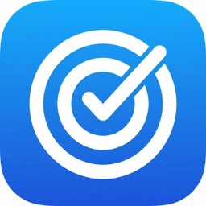

<p align="center">
  
</p>

<h1 align="center">SoloOKRs</h1>

<p align="center">
  <strong>macOS 전용 개인 OKR 관리 앱 — 내장 AI assistance & MCP 통합 지원</strong>
</p>

<p align="center">
  
  
  
  
</p>

---

## ✨ SoloOKRs란?

SoloOKRs는 **OKR(Objectives and Key Results)** 프레임워크를 활용하여 개인 목표를 관리하는 **macOS 네이티브 애플리케이션**입니다. 팀 중심의 OKR 도구와 달리 SoloOKRs는 개인 사용자를 위해 설계된 집중적이고 주의를 분산시키지 않는 환경으로, 개인 목표를 설정하고 추적하며 반성할 수 있습니다. 이 프로젝트는 Google Antigravity와의 vibe-coding 워크플로우로 구축되었습니다.

독보적인 기능:

- 🧠 **AI 지원** — 목표 다듬기, 핵심 결과 분해, 진행 상황 검토를 위한 AI 조언 제공
- 🔌 **MCP 서버** — Model Context Protocol을 통해 Claude Desktop 등 AI 어시스턴트에 OKR 데이터 노출
- 📊 **리뷰 모드** — 정기적인 OKR 리뷰를 위한 구조화된 반성 워크플로우
- ☁️ **iCloud 동기화** — Mac 기기 간 원활한 데이터 동기화
- 🌍 **9개 언어** — 실시간 언어 전환이 지원되는 완전한 다국어 기능

---

## 🌐 번역

전 세계 개발자들을 돕기 위해 이 README는 여러 언어로 제공됩니다:

| 언어           | 링크                                       |
| -------------- | ------------------------------------------ |
| 영어           | [README.md](README.md)                     |
| 중국어 간체    | [docs/README_zh.md](docs/README_zh.md)     |
| 일본어         | [docs/README_ja.md](docs/README_ja.md)     |
| 한국어         | [docs/README_ko.md](docs/README_ko.md)     |
| 독일어         | [docs/README_de.md](docs/README_de.md)     |
| 프랑스어       | [docs/README_fr.md](docs/README_fr.md)     |
| 스페인어       | [docs/README_es.md](docs/README_es.md)     |
| 포르투갈어(BR) | [docs/README_ptBR.md](docs/README_ptBR.md) |

---

## 🎯 기능

### 핵심 OKR 관리

| 기능                       | 설명                                                           |
| -------------------------- | -------------------------------------------------------------- |
| **목표(Objectives)**       | 진행률 추적과 함께 목표 생성, 편집, 보관                       |
| **핵심 결과(Key Results)** | 다양한 유형(비율, 숫자, 마일스톤)로 측정 가능한 핵심 결과 정의 |
| **작업(Tasks)**            | Markdown 설명으로 핵심 결과를 실행 가능한 작업으로 분해        |
| **보관함(Archives)**       | 트로피 표시가 있는 보관 섹션과 함께 완료된 목표 보관           |
| **드래그 앤 드롭**         | 드래그 앤 드롭으로 목표와 핵심 결과 순서 재조정                |

### 🧠 AI 통합

SoloOKRs에는 OKR 수명주기 전 과정에서 도움을 주는 내장 AI 어시스턴트가 포함되어 있습니다:

**지원 제공업체:**

| 제공업체      | 유형     | 설명                             |
| ------------- | -------- | -------------------------------- |
| **Gemini**    | 클라우드 | Google의 Gemini 모델             |
| **OpenAI**    | 클라우드 | GPT-4o 및 기타 OpenAI 모델       |
| **Anthropic** | 클라우드 | Claude 모델                      |
| **Ollama**    | 로컬     | 로컬 LLM 실행(Llama, Mistral 등) |
| **LM Studio** | 로컬     | 로컬 모델 추론 서버              |

**사용 방법:**

1. **Settings → AI**를 열고 원하는 제공업체 선택
2. API 키 입력(macOS Keychain에 안전하게 저장됨)
3. 로컬 제공업체(Ollama/LM Studio)의 경우, 로컬 서버가 실행 중인지 확인
4. 목표 및 핵심 결과 뷰에서 AI sparkle 버튼(✦)을 사용하여 조언 받기
5. AI 응답은 AI의 추론 과정을 보여주는 접이식 블록인 **thinking block** 시각화 포함

### 🔌 MCP 서버(Model Context Protocol)

SoloOKRs에는 내장 **MCP 서버**가 포함되어 있어 외부 AI 어시스턴트에 OKR 데이터를 노출합니다. 이를 통해 **Claude Desktop**과 같은 도구로 목표를 직접 읽고 조작할 수 있습니다.

**전송 옵션:**

| 전송                    | 프로토콜                  | 사용 사례                                  |
| ----------------------- | ------------------------- | ------------------------------------------ |
| **HTTP**                | `http://localhost:<port>` | 범용 접근, 웹 기반 도구                    |
| **Unix Domain Sockets** | `/tmp/solookrs.sock`      | Claude Desktop, 로컬 도구 (낮은 지연 시간) |

**사용 가능한 MCP 도구(12개):**

| 카테고리                   | 도구                                                                                           |
| -------------------------- | ---------------------------------------------------------------------------------------------- |
| **목표(Objectives)**       | `list_objectives`, `get_objective`, `create_objective`, `update_objective`, `delete_objective` |
| **핵심 결과(Key Results)** | `list_key_results`, `update_key_result`                                                        |
| **작업(Tasks)**            | `list_tasks`, `create_task`, `update_task`                                                     |
| **리뷰(Reviews)**          | `list_reviews`, `get_review`, `create_review`                                                  |

**Claude Desktop 통합:**

SoloOKRs를 Claude Desktop에 연결하려면 Claude Desktop 설정(`~/Library/Application Support/Claude/claude_desktop_config.json`)에 다음을 추가하세요:

```json
{
  "mcpServers": {
    "solookrs": {
      "command": "nc",
      "args": ["-U", "/tmp/solookrs.sock"]
    }
  }
}
```

또는 HTTP 전송의 경우:

```json
{
  "mcpServers": {
    "solookrs": {
      "url": "http://localhost:8716"
    }
  }
}
```

**활성화 방법:**

1. **Settings → MCP** 열기
2. MCP 서버 토글 켜기
3. 전송 방식 선택(HTTP 또는 Unix Socket)
4. 위의 연결 정보로 Claude Desktop 구성
5. 사이드바의 상태 표시기로 연결 상태 확인

### 📊 리뷰 모드

SoloOKRs에는 구조화된 **리뷰/반성** 워크플로우가 포함되어 있습니다:

1. **리뷰 생성** — 목표를 선택하고 리뷰 항목 생성
2. **KR 평가** — 노트와 함께 각 핵심 결과의 진행률을 평가
3. **AI 요약** — 선택적으로 AI 기반 리뷰 요약 생성
4. **리뷰 기록** — 시간 경과에 따른 과거 리뷰 조회 및 다시 확인
5. **Markdown 노트** — 전체 Markdown + 코드 구문 강조 처리로 풍부한 리뷰 노트 작성

### 🎨 사용자 정의 AI 프롬프트

**Settings → Prompts**를 통해 AI 동작을 조정하세요:

- 목표 조언을 위한 시스템 프롬프트 사용자 정의
- 핵심 결과 생성 프롬프트 조정
- 리뷰 요약 프롬프트 템플릿 수정
- 모든 프롬프트는 Markdown 형식 지원

---

## 🏗 아키텍처

```
SoloOKRs/
├── Models/           # SwiftData 모델 정의
│   ├── Objective     # 상위 레벨 목표
│   ├── KeyResult     # 측정 가능한 결과
│   ├── OKRTask       # 실행 가능 항목
│   ├── OKRReview     # 리뷰 세션
│   └── KRReviewEntry # 각 KR별 리뷰 항목
├── Views/
│   ├── Objectives/   # 사이드바 — 목표 목록 및 관리
│   ├── KeyResults/   # 중앙 컬럼 — KR 카드 및 생성
│   ├── Tasks/        # 상세 컬럼 — 작업 목록 및 편집기
│   ├── Reviews/      # 리뷰 생성 및 기록
│   ├── Settings/     # 설정 탭 (General, AI, Prompts, MCP, Sync)
│   └── Components/   # 공유 컴포넌트 (AIResponseView, MarkdownEditor)
├── Services/
│   ├── AIProvider/   # AIService, PromptManager, 제공업체 추상화
│   └── MCPServer/    # SwiftNIO 기반 MCP 서버 (HTTP + UDS)
└── Utilities/        # Keychain, Markdown 파싱, 구문 강조
```

**UI 레이아웃:** 3컬럼 `NavigationSplitView`

- **컬럼 1 (사이드바):** 상태 표시줄이 있는 목표 목록 (AI/MCP/Sync 표시기)
- **컬럼 2 (콘텐츠):** 선택된 목표의 핵심 결과
- **컬럼 3 (상세):** 선택된 핵심 결과의 작업

**지속성:** CloudKit 자동 동기화가 있는 SwiftData

---

## 🌍 로컬라이제이션

SoloOKRs는 실시간 전환이 지원되는 **9개 언어**(재시작 불필요)를 지원합니다:

| 언어                           | 코드      |
| ------------------------------ | --------- |
| 영어                           | `en`      |
| 중국어 간체(简体中文)          | `zh-Hans` |
| 중국어 번체(繁體中文)          | `zh-Hant` |
| 일본어(日本語)                 | `ja`      |
| 한국어(한국어)                 | `ko`      |
| 독일어(Deutsch)                | `de`      |
| 프랑스어(Français)             | `fr`      |
| 스페인어(Español)              | `es`      |
| 포르투갈어 - 브라질(Português) | `pt-BR`   |

**Settings → General → App Language**를 통해 언어를 변경하세요.

---

## 🚀 시작하기

### 사전 요구사항

- macOS 14.0(Sonoma) 이상
- Xcode 16.0 이상
- Apple Developer 계정(CloudKit 동기화용)

### 빌드 및 실행

```bash
# 저장소 클론
git clone https://github.com/your-username/SoloOKRs.git
cd SoloOKRs

# 빌드
cd src/SoloOKRs && xcodebuild -scheme SoloOKRs build -destination 'platform=macOS,arch=arm64'

# 또는 Xcode에서 열기
open src/SoloOKRs/SoloOKRs.xcodeproj
```

### 테스트 실행

```bash
cd src/SoloOKRs && xcodebuild -scheme SoloOKRs test -destination 'platform=macOS,arch=arm64'
```

---

## 🛡 보안

- **API 키**는 `kSecUseDataProtectionKeychain`을 사용하여 macOS **Keychain**에 저장됨
- **텔레메트리 없음** — 모든 데이터는 디바이스와 iCloud에만 저장됨
- **로컬 AI** — Ollama 및 LM Studio 지원으로 OKR 데이터가 기기 밖으로 나가지 않음

---

## 🙏 감사의 말

다음 멋진 오픈소스 라이브러리로 구축되었습니다:

- [MarkdownUI](https://github.com/gonzalezreal/swift-markdown-ui) — SwiftUI에서 Markdown 렌더링
- [Splash](https://github.com/JohnSundell/Splash) — 코드 구문 강조
- [SwiftNIO](https://github.com/apple/swift-nio) — 이벤트 기반 네트워킹 프레임워크

---

## 📄 라이선스

이 프로젝트는 **Creative Commons Attribution-NonCommercial-NoDerivatives 4.0 International License(CC BY-NC-ND 4.0)** 라이선스에 따라 라이선스가 부여됩니다.

### 다음을 자유롭게 할 수 있습니다:

- **공유** — 어떤 매체나 형식으로 자료를 복사하고 재배포할 수 있습니다

### 다음 조건 하에:

- **표시(Attribution)** — 적절한 크기를 부여하고, 라이선스 링크를 제공하며, 변경 사항을 표시해야 합니다
- **비영리(NonCommercial)** — 상업적 목적으로 재료를 사용할 수 **없습니다**
- **변형금지(NoDerivatives)** — 자료를 각색, 변환 또는 제작하는 경우, 수정된 재배포는 할 수 **없습니다**

### ⚠️ 상업적 사용은 엄격히 금지됩니다

다음에 국한되지 않습니다:

- 이익을 목적으로 애플리케이션 판매 또는 배포
- 상업용 제품 또는 서비스에 코드베이스 사용
- 이 소프트웨어 기반의 유료 서비스 제공

전체 라이선스 텍스트는 다음을 참조하세요: https://creativecommons.org/licenses/by-nc-nd/4.0/legalcode

---

<p align="center">
  Made with ❤️ for personal productivity
</p>
